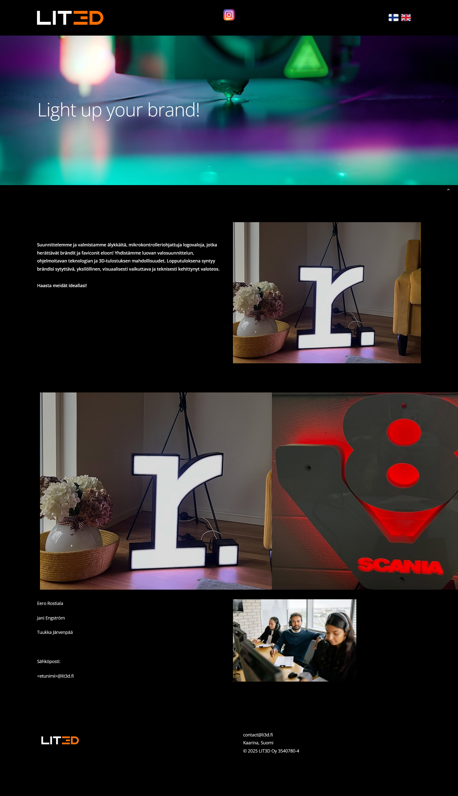
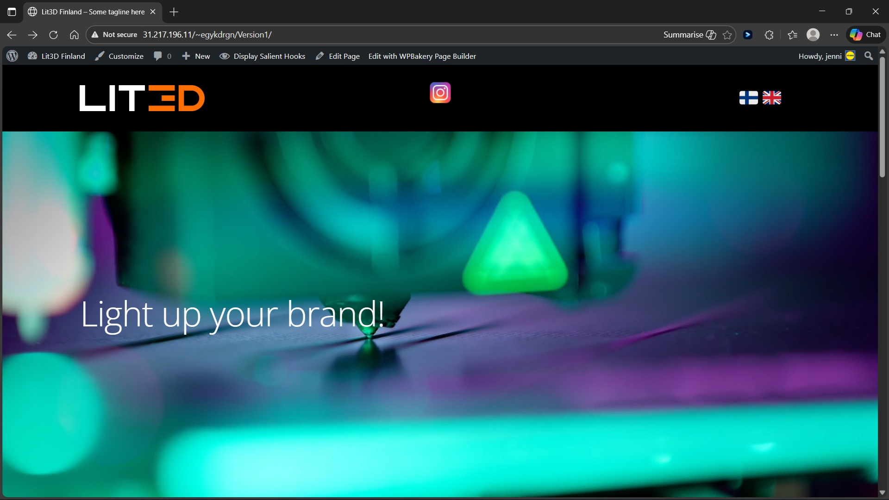
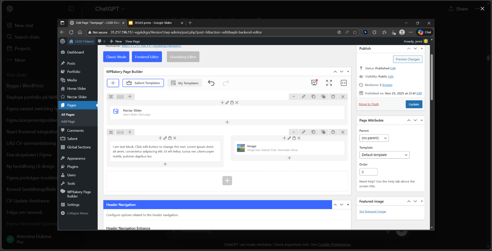
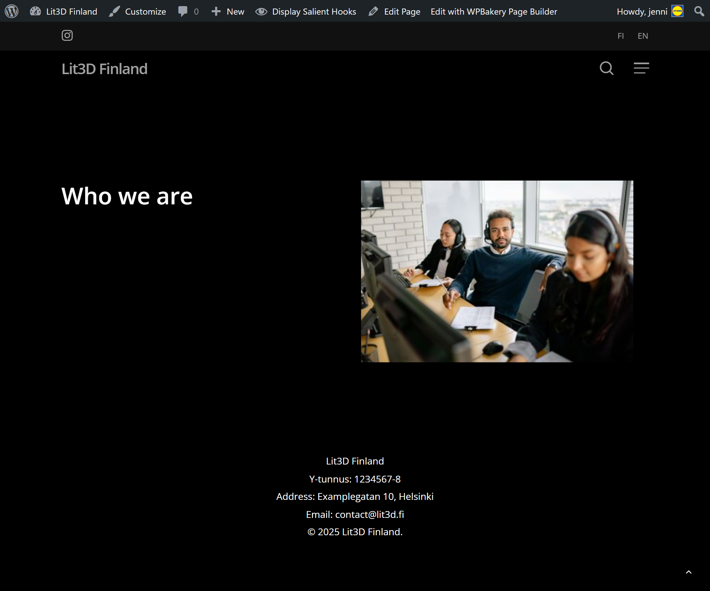
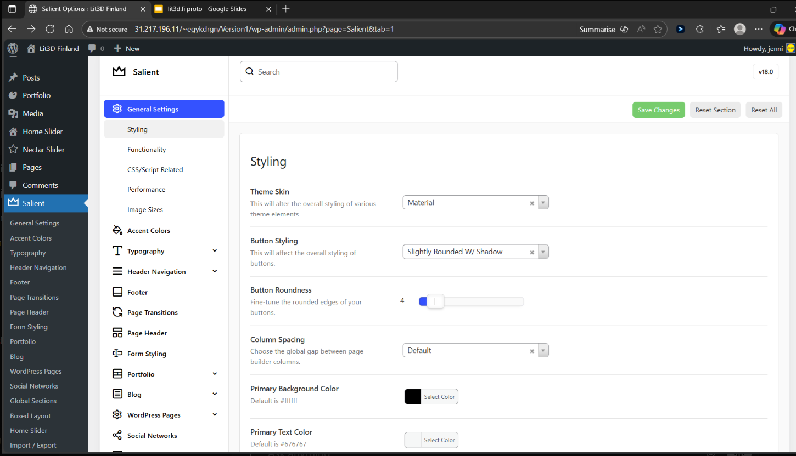

# Lit3D Finland – WordPress Website Project

## 📌 Project Overview

This project is a website I developed during my first internship period (LIA 1).
The goal was to build a functional and visually clean website based on a client-provided design.

The project was created using WordPress with a pre-built theme and page builder, focusing on layout, customization, and user experience rather than custom coding.

## 🛠️ Tools & Technologies

* WordPress (CMS)
* Salient Theme
* WPBakery Page Builder
* Custom CSS (for styling adjustments)
* Basic UI/UX design principles

## 💡 What I Did

* Built the website structure using WordPress
* Implemented a video hero section with overlay text
* Customized the header layout:

  * Added logo
  * Created language switch (flags)
  * Positioned social media icon (Instagram)
* Adjusted spacing, alignment, and responsiveness
* Configured navigation menus (main + secondary)
* Worked with image/content layout (grid & carousel)
* Applied custom CSS for fine-tuning design details
* Ensured mobile responsiveness

## 🎯 Key Features

* Responsive design (desktop & mobile)
* Custom header with branding elements
* Video background with overlay text
* Image carousel for product display
* Multi-language navigation concept (flags)
* Clean and minimal UI based on client design

## 📸 Screenshots

### Desktop View

### Mobile Version

### Header Design

### Sections Layout

### Footer

### WordPress Backend

## 📚 What I Learned

* How to work with WordPress themes and page builders
* Translating a design mockup into a real website
* Debugging layout and spacing issues
* Customizing headers and navigation systems
* Using CSS to refine visual details
* Working in a real client-like project environment
